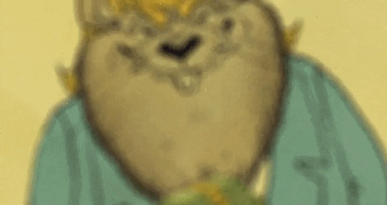

# The little junior dev is doing his work
## He's gonna give it his all to get the certificate.
### And finnally get to work in the job he's pationate with.
~~ will he do it ~~ ** of course he will **
* "The little developer learns Markdown via GitHub, creates branches, merges, and pushes modifications during this time...
The little developer was panicked as he was learning something new, but he quickly understood that
it's by coding that one becomes a coder."

The little developer had a moment of doubt, but he **pushed through** and 
**conquered his challenges**.
He **embraced every opportunity** to **learn, grow, and improve** his 
coding skills.
With **dedication and perseverance**, he transformed into a skilled and 
confident developer.

#The little junior dev doing his work

### The little devlopper will become a master
## his work will pay off
# And he will become rich

